# Лабораторная работа № 1 - Знакомство со средой программирования. Переменные

**Время выполнения - 6 часов**

## Содержание

___

1. [Общие теоретические сведения](#общие-теоретические-сведения)
    * [Установка Python на Windows](#установка-python-на-windows)
    * [Установка PyCharm на Windows](#установка-pycharm-в-windows)
    * [Проверка PyCharm и создание первого проекта](#проверка-pycharm-и-создание-первого-проекта)
2. [Практические задания](#практические-задания)
3. [Задания для самостоятельного выполнения (по вариантам)](#задания-для-самостоятельного-выполнения-по-вариантам)
    * [Задание 1](#задание-1-составить-написать-программу)
    * [Задание 2](#задание-2-составить-написать-программу)
    * [Задание 3](#задание-3-составить-написать-программу)
4. [Контрольные вопросы](#контрольные-вопросы)
5. [Содержание отчета](#содержание-отчета)

## Цель работы:

___

Научиться устанавливать и выполнять настройку программного обеспечения.

## Задачи работы:

___

1. Изучить:
    - этапы установки и настройки программного обеспечения;
    - среду программирования на языке Python.
2. Научиться:
    - устанавливать Python и дополнительные компоненты;
    - устанавливать и настраивать IDE;
    - настраивать основные элементы интерфейса;
    - создавать и сохранять первый проект;
    - оперировать понятиями "переменная", "значение переменной".

## Перечень обеспечивающих средств:

___

Для выполнения работы необходимо иметь компьютер с установленной операционной
системой семейства Windows/Linux/Mac OS, проектор, интерактивная доска.

## Общие теоретические сведения

___

`Python` – высокоуровневый язык программирования общего назначения. Он имеет
минималистичный синтаксис и направлен на повышение читаемости кода и в целом на
повышение производительности разработчика. Язык поддерживает несколько парадигм
программирования: объектно-ориентированное, функциональное, структурное,
императивное и аспектно-ориентированное. Основной упор в Python делается на
скорости написания кода. Все чаще Python используется для анализа данных, как в науке,
так и коммерческой сфере. Этому способствует простота языка и большое разнообразие
открытых библиотек.

Python является языком с полной динамической типизацией и автоматическим
управлением памятью. Динамическая типизация означает, что тип переменной
определяется только во время исполнения.

С одной стороны, динамическая типизация упрощает написание программ. Но с
другой, имеет ряд недостатков – повышается риск ошибиться с типами и снижает
производительность программы.

По производительности Python относительно медленный язык (по сравнению с `C`,
`Go`, `Java`). Его скорость выполнения схожа с другими интерпретируемыми языками (`PHP`,
`Ruby`). Однако возможность компиляции python-кода в байт-код позволяет добиться
большей производительности. Несмотря на это, в большинстве задач гораздо важнее
быстро получить результат, нежели ускорить выполнение программы.

Для написания кода в Python, интегрирования модулей и библиотек для построения
больших систем, текстового редактора недостаточно, поэтому рекомендуется
использовать интегрированную среду разработки для этих целей.

**Интегрированная среда разработки (англ. Integrated development environment)** – это
комплекс программных средств, используемый программистами для разработки
программного обеспечения.

Среда разработки включает в себя:

* текстовый редактор;
* транслятор (компилятор и/или интерпретатор);
* средства автоматизации сборки;
* отладчик.

Иногда содержит также средства для интеграции с системами управления версиями
и разнообразные инструменты для упрощения конструирования графического
интерфейса пользователя. Многие современные среды разработки также включают
браузер классов, инспектор объектов и диаграмму иерархии классов для использования
при объектно-ориентированной разработке программного обеспечения.
Интегрированные среды разработки обычно предназначены для нескольких языков
программирования, таких как `IntelliJ IDEA`, `NetBeans`, `Eclipse`, `Qt Creator`, `Geany`,
`Embarcadero RAD Studio`, `Code::Blocks`, `Xcode` или `Microsoft Visual Studio`, но есть и IDE
для одного определённого языка программирования – как, например, `Visual Basic`,
`Delphi`, `Dev-C++`.

Одной из популярных интегрированных сред разработки для Python является
`PyCharm`. Сейчас PyCharm распространяется в двух вариантах: платном (PyCharm
Professional Edition) и бесплатном (PyCharm Community Edition).

Бесплатная версия имеет открытый исходный код и распространяется под
лицензией Apache 2. Это облегченная среда, которая подходит для разработки только на
Python.

Платный вариант представляет собой более расширенную и функциональную
версию с возможностью разработки, в том числе многоязычных веб-приложений.
Professional Edition поддерживает фреймворки:

* Django;
* Flask;
* Google App Engine;
* Pyramid;
* web2py.

PyCharm Professional Edition предоставляет возможность удаленной разработки, а
также работы с базами данных.

PyCharm имеет удобный редактор кода со всеми полезными функциями: подсветкой
синтаксиса, автоматическим форматированием, дополнением и отступами. PyCharm
позволяет проверять версии интерпретатора языка на совместимость, а также
использовать шаблоны кода.

Тем, кто часто использует документацию, будет удобно смотреть ее прямо в окне
редактора (для элементов) либо в браузере (для внешней документации).

PyCharm позволяет быстро производить рефакторинг кода, а также использовать
удобный графический отладчик.

Утилита поддерживает все свежие версии `Django`, а также `IronPython`, `Jython`,
`Cython`, `PyPy` `wxPython`, `PyQt`, `PyGTK` и многие другие инструменты.

В PyCharm можно проводить интегрированное Unit тестирование, использовать
интерактивные консоли для Python, Django, SSH, отладчика и баз данных.

PyCharm имеет большую коллекцию плагинов, и его можно использовать в связке с
разными трекерами вроде JIRA, Youtrack, Lighthouse, Redmine, Trac и так далее.

PyCharm кроссплатформенная среда разработки: можно использовать на Linux,
Windows и Mac OS.

Предварительно необходимо выполнить установку и настройку программного
обеспечения для выполнения лабораторных работ.

### Установка Python на Windows

___
Для установки python необходимо скачать с официального сайта [python.org](https://python.org)
необходимый релиз

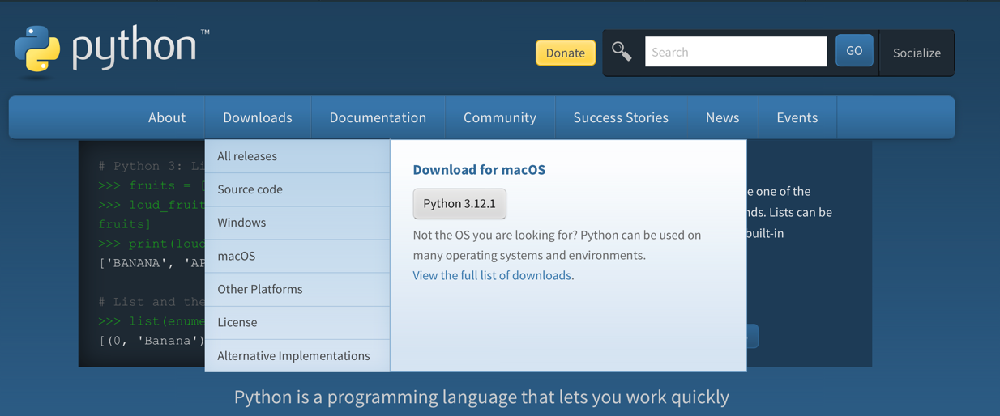

На данный момент последняя доступная сборка – 3.12.1. После скачивания
запускаем файл. По умолчанию в комплекте устанавливаются IDLE (среда разработки
Python-программ), документация, менеджер пакетов pip (для скачивания и установки
других пакетов на Python), стандартный набор тестов и Python Launcher для запуска
программ с расширением *.py.

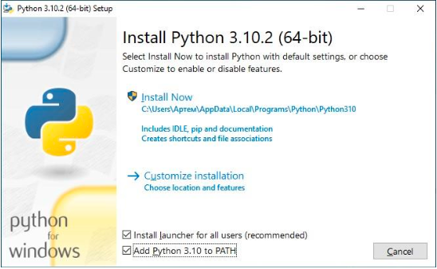

На данном шаге необходимо отметить дополнения, устанавливаемые вместе с
интерпретатором Python. Рекомендуем выбрать все опции. Разберем какие
опции доступны для выбора:

* **Documentation** – установка документаций;
* **pip** – установка пакетного менеджера pip;
* **tcl/tk and IDLE** – установка интегрированной среды разработки (IDLE) и
  библиотеки для построения графического интерфейса (tkinter).

На следующем шаге установки необходимо выбрать путь для установки и выбрать
«Установку для всех пользователей (Install for all users)»

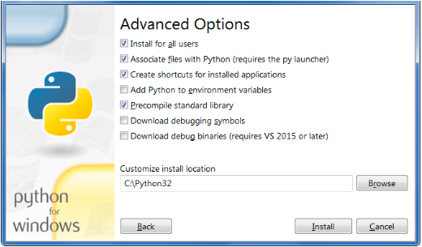

Помимо указания пути, данное окно позволяет внести дополнительные изменения
в процесс установки с помощью опций:

* **Install for all users** – Установить для всех пользователей. Если не выбрать данную
  опцию, то будет предложен вариант инсталляции в папку пользователя,
  устанавливающего интерпретатор.
* **Associate files with Python** – Связать файлы, имеющие расширение .py, с Python.
  При выборе данной опции будут внесены изменения в Windows, позволяющие запускать
  Python скрипты по двойному щелчку мыши.
* **Create shortcuts for installed applications** – Создать ярлыки для запуска
  приложений.
* **Add Python to environment variables** – Добавить пути до интерпретатора Python в
  переменную PATH.
* **Precomple standard library** – Провести прекомпиляцию стандартной библиотеки.
  Последние два пункта связаны с загрузкой компонентов для отладки, их установка
  производиться не будет.

После успешной установки появится сообщение, отображаемое на рисунке

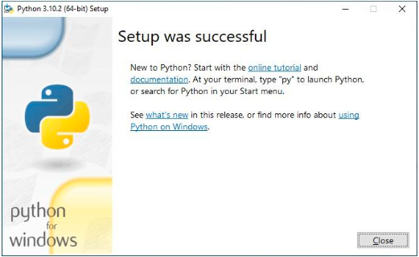

### Установка PyCharm в Windows

___

Если в процессе разработки необходим отладчик, то тогда одним из лучших
вариантов будет IDE PyCharm от компании JetBrains. Скачать данный продукт можно с
официального сайта [www.jetbrains.com](https://www.jetbrains.com).

IDE доступна для Windows, Linux и MacOS. Существуют два вида лицензии
PyCharm – это Professional и Community. Для выполнения лабораторных работ будет
использоваться версия Professional. Для получения данной версии необходимо
зарегистрироваться на официальном сайте и получить индивидуальную студенческую
лицензию сроком на один год. Далее эту лицензию можно будет продлить.

Запустите скачанный дистрибутив PyCharm.

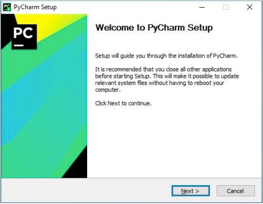

Далее необходимо выбрать путь установки программы

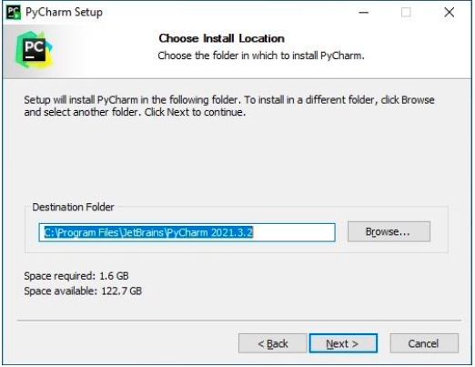

На следующем шаге необходимо указать ярлыки, которые нужно создать на
рабочем столе (запуск 32-х и 64-х разрядной версии PyCharm) и отметить опцию из блока
_Create associations_ если требуется связать файлы с расширением .py с PyCharm.

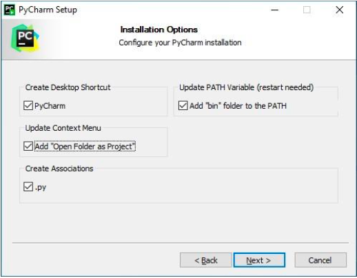

Далее требуется выбрать имя для папки в меню Пуск

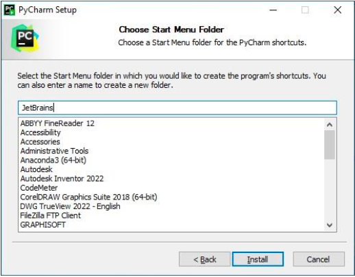

Далее PyCharm будет установлен на ваш компьютер.

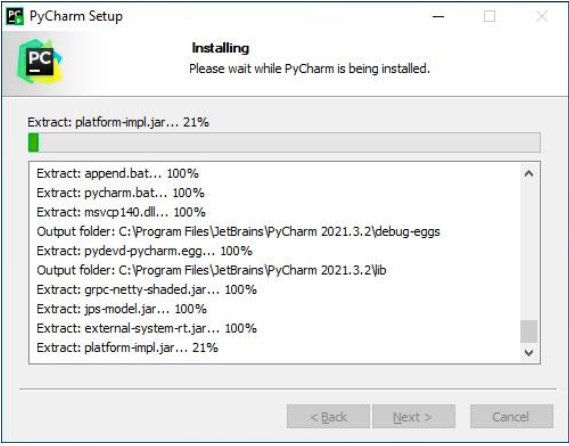

### Проверка PyCharm и создание первого проекта.

___

Запустите PyCharm и выберете **Create New Project** в появившемся окне.

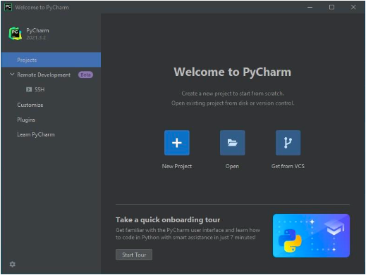

Укажите путь до проекта Python и интерпретатор, который будет использоваться
для запуска и отладки.

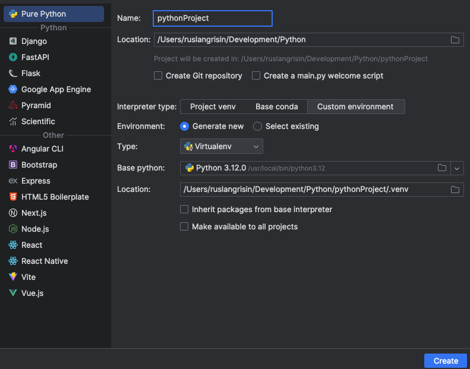

Введите код программы:

`print('hello, student SSUGT')`

Запустите программу и посмотрите что произошло.

Любую программу на языке Python можно представить как набор лексем
(допустимых символов), записанных в определённом порядке и по определённым
правилам. Лексема может представлять собой: литералы, знаки пунктуации,
переменные, специальные ключевые слова, комментарии.

Программа на языке Python может содержать достаточное количество
комментариев, каждый комментарий начинается с символа `#` «решётка».

Литералы представляют собой значения, заданные в коде программы, например
числа (2 5) или строки ("Привет"). В языке Python используется динамическая типизация
(типы данных определяются автоматически, и их не требуется объявлять в программном
коде), но при этом Python является языком со строгой типизацией (вы сможете
выполнять над объектом только те операции, которые применимы к его типу).

Переменные используются для хранения данных. Есть определённые правила для
задания имён переменных (идентификаторов): это последовательность букв и цифр,
которая не может начинаться с цифры, но может содержать символ подчёркивания (_).
Имена переменных чувствительны к регистру. Имена переменных не могут совпадать с
ключевыми словами.

Ключевые слова в языке Python имеют специальное назначение и представляют
собой управляющие конструкции языка. Примеры: `and`, `break`, `for` и т.д.

При составлении программ лексемы объединяются в синтаксические конструкции,
которые могут вкладываться друг в друга.

Обычно среда программирования сразу делает отступ для блока после двоеточия. В
зависимости от используемой среды программирования блоки могут иметь визуальное
выделение.

Перейдём к рассмотрению основных операторов языка. **Оператор** – это конструкция
языка, определяющая команду (набор команд) языка программирования, задающая
выполнение действий.

Представленные в таблице операторы можно разделить на следующие типы:
арифметические, операторы сравнения, логические

| **Оператор** |     **Описание**      |
|:------------:|:---------------------:|
|     `+`      |       Сложение        |
|     `-`      |       Вычитание       |
|     `*`      |       Умножение       |
|     `/`      |        Деление        |
|     `//`     | Целочисленное деление |
|     `%`      |  Остаток от деления   |
|     `**`     | Возведение в степень  |
|     `<`      |        Меньше         |
|     `>`      |        Больше         |
|     `>=`     |   Больше или равно    |
|     `<=`     |   Меньше или равно    |
|     `!=`     |       Не равно        |
|    `and`     | Логическое умножение  |
|     `or`     |  Логическое сложение  |
|    `not`     | Логическое отрицание  |

Один из самых часто используемых операторов – оператор присваивания. Оператор
присваивания в языке Python имеет вид:
`<идентификатор> = <выражение>`

Значения выражения, которое стоит справа от знака `=`, присваивается переменной
(записывается в эту переменную – в память), расположенной слева от знака `=`.
Также в языке Python есть сложные операторы присваивания, они представлены в таблице

| **Обозначение** | **Описание**                                                                                                                                           |
|:---------------:|:-------------------------------------------------------------------------------------------------------------------------------------------------------|
|      `+=`       | Значения левой и правой частей оператора присваивания суммируются,результат присваивается переменной в левой части                                     |
|      `-=`       | Вычитается значение правой части из значения переменной в левой части,результат присваивается переменной в левой части                                 |
|      `*=`       | Значения левой и правой частей перемножаются, результат присваивается переменной в левой части                                                         |
|      `/=`       | Значение переменной из левой части делится на значение выражения в правой части, результат присваивается переменной в левой части                      |
|      `%=`       | Находится остаток от деления значения переменной в левой части на значение выражения в правой части, результат присваивается переменной в левой части  |
|      `**=`      | Выполняется возведение значения переменной в левой части в степень значения выражения в правой части, результат присваивается переменной в левой части |
|      `//=`      | Делится нацело значение переменной в левой части на значение выражения в правой части, результат присваивается переменной в левой части                |

Часто при решении задач необходимо выполнять ввод данных с клавиатуры и
выводить данные на экран. Рассмотрим работу соответствующих операторов в языке
Python.

Вывод данных осуществляется с помощью оператора `print`. Формат
оператора:

`print("Hello")`

После выполнения оператора `print` курсор переходит на новую строку.
Для вывода в строку необходимо добавить аргумент `end="<разделитель>"`:

`print("Hello", end="  ")`

Выводить на экран можно не только значения переменных, но и значения
выражений.

Также в языке Python можно использовать форматированный вывод. Для этого
необходимо использовать встроенные инструменты. Синтаксис:

```python
a = 12
b = 13
c = a + b
print(f"{a} + {b} = {c}")
```

Для ввода данных с клавиатуры используется встроенная функция `input()`. Функция
`input()` возвращает в качестве результата строку!

В результате выполнения программы:

```python
a = input()
b = input()
c = a + b
print(c)
```

На экран выводится не сумма чисел. Выводится строка – сцепление двух строк. Если
необходимо ввести числовые значения, то следует использовать встроенные функции
int и float.

Функция int используется для преобразования строки в целое число. Изменим
предыдущий пример:

```python
a = int(input())
b = int(input())
c = a + b
print(c)
```

Результат работы – сумма чисел.

Все математические функции в языке Python объединены в модуль math. Данный
модуль при необходимости нужно импортировать с помощью команды import:

`import math`

После подключения этого модуля можно использовать всё множество
математических функций языка Python. В составе модуля math есть несколько известных
математических констант

| **Обозначение константы** | **Описание**                             |
|:-------------------------:|:-----------------------------------------|
|         `math.pi`         | Математическая константа п = 3,141592... |
|         `math.e`          | Число Эйлера е = 2,71828.                |
|        `math.inf `        | Положительная бесконечность              |
|       `math.exp(x)`       | Экспонента числа е^х                     |
|    `math.log(X, [A])`     | Логарифм X по основанию А.               |
|     `math.pow(X, n)`      | Возведение X в степень n.                |
|      `math.sqrt(X)`       | Квадратный корень из X                   |
|       `math.cos(X)`       | Косинус X (X указывается в радианах)     |
|       `math.sin(X)`       | Синус X (X указывается в радианах)       |
|       `math.tan(X)`       | Тангенс X (X указывается в радианах)     |
|      `math.acos(X)`       | Арккосинус X (X указывается в радианах)  |
|      `math.asin(X)`       | Арксинус X (X указывается в радианах)    |
|      `math.atan(X)`       | Арктангенс X (X указывается в радианах)  |
|     `math.degrees(X)`     | Конвертирует радианы в градусы           |
|     `math.radians(X)`     | Конвертирует градусы в радианы           |

Полный список математических функций можно вывести командой:

```python
import math

print(dir(math))
```

Также в языке Python есть возможность получения так называемых
псевдослучайных чисел. Данные числа вычисляются по некоторой математической
формуле, могут использоваться несколько алгоритмов (в языке Python используется
алгоритм «вихрь Мерсенна»).

Для получения таких чисел необходимо обратиться к модулю random. Имеется
возможность получать как целые, так и вещественные случайные числа:

* `randint(a, b)` – возвращает случайное целое число из отрезка `[а;b]`;
* `uniform(a, b)` – возвращает случайное вещественное число из отрезка `[а; b]`.

Пример:

```python
from random import randint, uniform

a = randint(1, 100)
b = uniform(1, 200)
print(a)
print(b)
```

## Практические задания

___

1. Написать программу нахождения периметра и
   площади прямоугольника (значения длин сторон вводятся с клавиатуры);
2. Написать программу вычисления значения функции
   `y(x) = x^2 – 7x + 8` для заданного с клавиатуры значения аргумента х;
3. Написать программу вычисления расстояния между
   двумя точками, заданными на плоскости своими координатами;
4. Напишите программу, которая вычисляет
   квадратный корень введённого числа. Вычислите с её помощью квадратные корни из
   чисел 121841; 34545,56 и 132349,9032;
5. Напишите программу для следующего условия
   задачи: игральный кубик бросается три раза (выпадает три случайных значения). Из этих
   чисел составляется целое число, программа должна найти его квадрат.

## Задания для самостоятельного выполнения (по вариантам)

___

### Задание 1. Написать программу.

| **Вариант** | **Задание**                                                                                                                                                                                                                     |
|:-----------:|:--------------------------------------------------------------------------------------------------------------------------------------------------------------------------------------------------------------------------------|
|      1      | Напишите программу, которая считывает три числа и выводит сумму их квадратов. Каждое число записано в отдельной строке.                                                                                                         |
|      2      | Напишите программу, которая считывает длины двух катетов в прямоугольном треугольнике и выводит его площадь. Каждое число записано в отдельной строке.                                                                          |
|      3      | Напишите программу, которая считывает длину радиуса окружности и выводит длину окружности и площадь круга.                                                                                                                      |
|      4      | Напишите программу, которая считывает два числа M и N и выводит процентное соотношение M и N. Каждое число записано в отдельной строке.                                                                                         |
|      5      | Напишите программу, которая считывает длины двух катетов в прямоугольном треугольнике и выводит длину его гипотенузы. Каждое число записано в отдельной строке.                                                                 |
|      6      | Напишите программу, которая считывает три вещественных числа и выводит произведение их целых частей. Каждое числозаписано в отдельной строке.                                                                                   |
|      7      | Напишите программу, которая считывает два целых и два вещественных числа и выводит случайные числа в их пределах. Каждое число записано в отдельной строке.                                                                     |
|      8      | Напишите программу, которая считывает два целых и два вещественных числа, и составьте из них два комплексных числа. Затем определите сумму действительных частей и произведение мнимых частей и выведите результаты вычислений. |
|      9      | Напишите программу, которая приветствует пользователя, выводя слово «Hello», введенное имя и знаки препинания по образцу: «Hello, USER!»                                                                                        |
|     10      | Напишите программу, которая считывает целое число num и выводит текст, аналогичный приведенному тексту (пробелы важны!): «Это номер, следующий за номером num», «Это номер, предшествующий номеру num».                         |
|     11      | Дано натуральное число. Выведите его последнюю цифру.                                                                                                                                                                           |
|     12      | Дано положительное действительное число X. Выведите его дробную часть.                                                                                                                                                          |
|     13      | Дано положительное действительное число X. Выведите его первую цифру после десятичной точки.                                                                                                                                    |
|     14      | Дано натуральное число. Найдите число десятков в его десятичной записи.                                                                                                                                                         |
|     15      | Дано трехзначное число. Найдите сумму его цифр.                                                                                                                                                                                 |

### Задание 2. Написать программу.

| **Вариант** | **Задание**                                                                                                                                                                                                                                                                                                                                                                                                                                       |
|:-----------:|:--------------------------------------------------------------------------------------------------------------------------------------------------------------------------------------------------------------------------------------------------------------------------------------------------------------------------------------------------------------------------------------------------------------------------------------------------|
|      1      | Дана строка, состоящая из слов, разделенных пробелами. Определите, сколько в ней слов. Используйте для решения задачи метод count.                                                                                                                                                                                                                                                                                                                |
|      2      | Дана строка. Разрежьте ее на две равные части, если длина строки четная. Если же длина строки нечетная, то длина первой части должна быть на один символ больше. Переставьте эти две части местами, результат запишите в новую строку и выведите на экран. **При решении этой задачи нельзя пользоваться инструкцией if**.                                                                                                                        |
|      3      | Дана строка, в которой буква «h» встречается минимум два раза. Удалите из этой строки первое и последнее вхождение буквы «h», а также все символы, находящиеся между ними.                                                                                                                                                                                                                                                                        |
|      4      | Дана строка, состоящая из двух слов, разделенных пробелом. Переставьте эти слова местами. Результат запишите в строку и выведите получившуюся строку. **При решении этой задачи нельзя пользоваться циклами и инструкцией if**.                                                                                                                                                                                                                   |
|      5      | Дана строка. Замените в этой строке все цифры «1» на слово «one».                                                                                                                                                                                                                                                                                                                                                                                 |
|      6      | Дана строка. Удалите из этой строки все символы «#».                                                                                                                                                                                                                                                                                                                                                                                              |
|      7      | Дана строка. Замените в этой строке все буквы «h» на буквы «H», кроме первого и последнего вхождения.                                                                                                                                                                                                                                                                                                                                             |
|      8      | Введите две строки, сложите их. В суммарной строке посчитайте количество символов «о».                                                                                                                                                                                                                                                                                                                                                            |
|      9      | Дана строка. Посчитайте в этой строке количество всех букв «h», кроме первого и последнего вхождения.                                                                                                                                                                                                                                                                                                                                             |
|     10      | Дана строка.<br/> – в первой строке выведите третий символ этой строки;<br/> – во второй строке выведите предпоследний символ этой строки;<br/> – в третьей строке выведите первые пять символов этой строки.<br/> – в четвертой строке выведите всю строку, кроме последних двух символов;<br/> – в пятой строке выведите все символы с четными индексами  (считая, что индексация начинается с 0, поэтому символы выводятся начиная с первого). |
|     11      | Введите строку, состоящую из десяти символов, разделенных пробелом по пять символов. Разбейте эту строку на две строки по пять символов.                                                                                                                                                                                                                                                                                                          |
|     12      | Дана строка: выведите все символы с нечетными индексами, т. е. начиная со второго символа строки; выведите все символы в обратном порядке; выведите все символы строки через один в обратном порядке, начиная с последнего; выведите длину данной строки.                                                                                                                                                                                         |
|     13      | Введите строку, состоящую из 5 символов, разделенных пробелом по три символа. Разбейте эту строку на две строки.                                                                                                                                                                                                                                                                                                                                  |
|     14      | Введите три строки, сложите их. В суммарной строке посчитайте количество символов «s».                                                                                                                                                                                                                                                                                                                                                            |
|     15      | Дана строка. Замените в этой строке все цифры «0» на слово «zero» и посчитайте их количество.                                                                                                                                                                                                                                                                                                                                                     |

### Задание 3. Написать программу.

| **Вариант** | **Задание**                                                                                                                                                                                                                                                                                                                                                                                                                                                                                 |
|:-----------:|:--------------------------------------------------------------------------------------------------------------------------------------------------------------------------------------------------------------------------------------------------------------------------------------------------------------------------------------------------------------------------------------------------------------------------------------------------------------------------------------------|
|      1      | N школьников делят k яблок поровну, неделящийся остаток остается в корзинке. Сколько яблок достанется каждому школьнику? Сколько яблок останется в корзинке? Программа получает на вход числа N и k и должна вывести искомое количество яблок (два числа).                                                                                                                                                                                                                                  |
|      2      | Дано число n. С начала суток прошло n минут. Определите, сколько часов и минут будут показывать электронные часы в этот момент. Программа должна вывести два числа: количество часов (от 0 до 23) и количество минут (от 0 до 59). Учтите, что число n может быть больше, чем количество минут в сутках.                                                                                                                                                                                    |
|      3      | В школе решили набрать три новых математических класса. Так как занятия по математике у них проходят в одно и то же время, было решено выделить кабинеты для каждого класса и купить в них новые парты. За каждой партой может сидеть не больше двух учеников. Известно количество учащихся в каждом из трех классов. Сколько всего нужно закупить парт, чтобы их хватило на всех учеников? Программа получает на вход три натуральных числа: количество учащихся в каждом из трех классов. |
|      4      | Длина кольцевой автомобильной дороги 109 км. Байкер стартует с нулевого километра кольцевой дороги и едет со скоростью v км/ч. На какой отметке он остановится через t часов? Программа получает на вход значение v и t. Программа должна вывести целое число от 0 до 108 и номер отметки, на которой остановится байкер.                                                                                                                                                                   |
|      5      | В некоторой школе занятия начинаются в 9:00. Продолжительность урока 45 минут. После 1, 3, 5-го и т. д. уроков перемена 5 минут, а после 2, 4, 6-го и т. д. 15 минут. Дан номер урока (число от 1 до 10). Определите, когда заканчивается указанный урок. Выведите два целых числа: время окончания урока в часах и минутах.                                                                                                                                                                |
|      6      | За день машина проезжает n километров. Сколько дней нужно, чтобы проехать маршрут длиной m километров? Программа получает на вход числа n и m.                                                                                                                                                                                                                                                                                                                                              |
|      7      | Даны значения двух моментов времени, принадлежащих одним и тем же суткам: часы, минуты и секунды для каждого из моментов времени. Известно, что второй момент времени наступил не раньше первого. Определите, сколько секунд прошло между двумя моментами времени. Программа получает на вход три целых числа – часы, минуты, секунды, задающие первый момент времени, и три целых числа, задающих второй момент времени. Выведите число секунд между этими моментами времени.              |
|      8      | Процентная ставка по вкладу составляет P процентов годовых, которые прибавляются к сумме вклада. Вклад составляет X рублей Y копеек. Определите размер вклада через год. Программа получает на вход целые числа P, X, Y и должна вывести два числа: величину вклада через год в рублях и копейках. Дробная часть копеек отбрасывается.                                                                                                                                                      |
|      9      | С начала суток прошло H часов, M минут, S секунд (0 ≤ H < 12, 0 ≤ M < 60, 0 ≤ S < 60). По данным числам H, M, S определите угол (в градусах), на который повернулась часовая стрелка с начала суток, и выведите его в виде действительного числа.                                                                                                                                                                                                                                           |
|     10      | С начала суток часовая стрелка повернулась на угол α градусов. Определите, сколько полных часов, минут и секунд прошло с начала суток. Запишите ответ в три переменные и выведите их на экран.                                                                                                                                                                                                                                                                                              |
|     11      | С начала суток прошло n секунд. Определите, сколько часов, минут и секунд будут показывать электронные часы в этот момент.                                                                                                                                                                                                                                                                                                                                                                  |
|     12      | Улитка ползет по вертикальному шесту высотой h метров, поднимаясь за день на a метров, а за ночь спускаясь на b метров. На какой день улитка доползет до вершины шеста? Программа получает на вход натуральные числа h, a, b. Программа должна вывести одно натуральное число. Гарантируется, что a > b.                                                                                                                                                                                    |
|     13      | Резиновое кольцо диаметром d разрезали в n местах. Какова средняя длина получившихся кусков?                                                                                                                                                                                                                                                                                                                                                                                                |
|     14      | От бревна длиной L отпиливают куски длиной x. Сколько целых полноразмерных кусков максимально удастся отпилить?                                                                                                                                                                                                                                                                                                                                                                             |
|     15      | x – вещественное число. Запишите выражение, позволяющее выделить его дробную часть.                                                                                                                                                                                                                                                                                                                                                                                                         |

## Контрольные вопросы

___

1. Какие основные операторы языка Python вы использовали при выполнении
   лабораторной работы?
2. Для чего используется оператор print при работе в языке Python?
3. Как можно возвести число в квадрат в языке Python?
4. Какой оператор используется для ввода целых чисел с клавиатуры;
   вещественных чисел с клавиатуры?

## Содержание отчета

___

1. Титульный лист
2. Цель и задачи работы
3. Задание
4. Описание выполнения алгоритма
5. Исходный код программы
6. Результаты работы программы
7. Ответы на контрольные вопросы.
8. Общий вывод о проделанной работе.