# Лаораторная работа № 2 - условный оператор IF

**Время выполнения - 4 часа**

## Содержание

___

1. [Общие теоретические сведения](#общие-теоретические-сведения)
2. [Практические задания](#практические-задания)
3. [Задания для самостоятельного выполнения (по вариантам)](#задания-для-самостоятельного-выполнения-по-вариантам)
    * [Задание 1](#задание-1-написать-программу)
    * [Задание 2](#задание-2-написать-программу)
    * [Задание 3](#задание-3-написать-программу)
4. [Контрольные вопросы](#контрольные-вопросы)
5. [Содержание отчета](#содержание-отчета)

## Цель работы:

___

Ознакомться с условным оператором if на языке программирования Python

## Задачи работы:

___

1. Изучить формы условного оператора if;
2. Научиться использовать условный оператор if в среде программирования на языке Python;
3. Научиться разрабатывать программы, реализующие разветвляющиеся алгоритмы.

## Общие теоретические сведения

___

При решении задач важно реализовывать возможность выбора среди
альтернативных операций на основе результатов проверки. В императивных языках
программирования для этих целей используется оператор ветвления (условный
оператор). В языке Python подобный оператор предусматривает возможность сделать
выбор как из двух альтернативных ветвей программы, так и из трёх и более.

Общая форма условного оператора:

```python
if < условие1 >:
    оператор1
elif < условие2 >:
    оператор2
else:
    оператор3
```

Части `else` и `elif` являются необязательными. После части `if` указывается логическое
условие, которое может быть истинным или ложным.

Как видно из описания условного оператора, он может содержать другие операторы,
например операторы and (конъюнкция), or (дизъюнкция), not – отрицание, равенство ==,
неравенство !=. Также в Python можно записывать двойное условие, например 2<=a<=5,
-10<v<=9. В том числе условный оператор может содержать внутри себя другой
условный оператор.

Стоит обратить внимание на то, что после логического условия стоит двоеточие,
для того чтобы показать, что далее идёт блок выражений. Блок выражений записывается
с отступом.

Рассмотрим работу условного оператора более подробно.
В самом простом случае оператор ветвления имеет вид:

```python
if < условие >:
    оператор1
```

Это неполная форма условного оператора.

В случае истинности условия выполняется оператор1, а затем осуществляется
выход из условного оператора (управление передаётся оператору, следующему за
оператором if).

Пример написания программы:

```python
a = int(input())
if a < 0:
    print("Ниже")
```

В данном примере в качестве условия используется сравнение a < 0. Если это
условие истинно, то на экран выводится текст «Ниже». Если же условие ложно, то
программа ничего не выполняет.

Приведем еще один пример:

```python
a = int(input())
if (a < 0) and (a >= -3):
    print("Ниже")
```

В данном примере условие составное: состоит из двух условий, объединённых
операцией and (логическое «и»).

Рассмотрим далее более сложный вид оператора ветвления:

```python
if < условие >:
    оператор1
else:
    оператор2
```

Обратите внимание на порядок отступов в формате оператора! Это полная форма
условного оператора.

Если условие истинно, то выполняется оператор1, в противном случае (если условие
ложно), выполняется оператор2. Далее управление переходит к оператору, который
следует за условным оператором.

Приведём примеры работы такой формы условного оператора.

```python
a = int(input())
b = int(input())
if a + b > 10:
    print("Yes")
else:
    print("No")
```

В данном примере в случае истинности условия `a+b>10` выполняется оператор
`print(“Yes”)`, в противном случае – `print(“No”)`.

После условия и после части `else` можно указывать несколько операторов, но тогда
все они записываются с отступом! Для сравнения рассмотрим пример:

```python
a = 10
b = 15
c = 3
if a + b > 10:
    print("Yes")
else:
    print("No")
print(c)
```

Третья форма оператора ветвления выглядит следующим образом:

```python
if < условие1 >:
    оператор1
elif < условие2 >:
    оператор2
else:
    оператор3
```

При использовании данной формы можно проводить проверку нескольких
условий – после if и после elif. Оператор после else выполняется в том случае, если не
выполнилось условие2 после части elif.

Рассмотрим пример использования данной формы оператора if:

```python
a = 10
if a < -5:
    print("Yes")
elif -5 <= a <= 5:
    print("Maybe")
else:
    print("No")
```

Ещё раз обратимся к синтаксическим правилам языка Python.
В Python отсутствуют фигурные скобки (которые есть в языке С/С++) или
разделители begin/end (которыми оперирует язык Pascal), окружающие блоки
программного кода. Вместо этого принадлежность операторов к вложенному блоку
определяется по величине отступов. Также операторы в языке Python обычно не
завершаются точкой с запятой; признаком конца оператора служит конец строки с этим
оператором.

Все составные операторы в языке Python оформляются одинаково: строка с
заголовком завершается двоеточием, далее следуют вложенные операторы (один или
более), обычно с отступом относительно заголовка. Эти операции с отступами
называются блоком (или иногда набором).

Интерпретатор автоматически определяет границы блоков по величине отступов,
т. е. по ширине пустого пространства слева от программного кода. Все операторы,
смещенные вправо на одинаковое расстояние, принадлежат к одному и тому же блоку
кода.

## Практические задания

___

1. Написать программу вычисления оптимального
   веса. Оптимальный вес вычисляется по формуле: рост (см) – 100. Пользователю должны
   выдаваться рекомендация о снижении или наборе веса;
2. Написать программу, определяющую вид треугольника (равносторонний,
   равнобедренный, разносторонний) по заданным длинам сторон.
3. Написать программу, которая считывает три вещественных числа и заменяет
   каждое чётное значение его частным от деления на 2, а единицу – числом 2.
4. Определить, является ли введённый пользователем год високосным.
5. Написать программу, проверяющую, является ли введённое число чётным
   или оно нечётное.

## Задания для самостоятельного выполнения (по вариантам)

___

### Задание 1. Написать программу

| **Вариант** | **Задание**                                                                                                                                                                                                                          |
|:-----------:|:-------------------------------------------------------------------------------------------------------------------------------------------------------------------------------------------------------------------------------------|
|      1      | Составить программу, которая будет считывать введённое пятизначное число. После чего, каждую цифру этого числа необходимо вывести в новой строке.                                                                                    |
|      2      | Запрограммировать следующее выражение: (а + b – f / а) + f * a * a – (a + b) Числа а, b, f вводятся с клавиатуры. Организовать пользовательский интерфейс, таким образом, чтоб было понятно, в каком порядке должны вводиться числа. |
|      3      | Написать программу, которая вычисляет частное двух чисел. Программа должна проверять правильность введенных пользователем данных и, если они неверные (делитель равен нулю), выдавать сообщение об ошибке.                           |
|      4      | Написать программу вычисления площади кольца. Программа должна проверять правильность исходных данных.                                                                                                                               |
|      5      | Написать программу, которая переводит время из минут и секунд в секунды. Программа должна проверять правильность введенных пользователем данных и в случае, если данные неверные, выводить соответствующее сообщение.                |
|      6      | Написать программу вычисления сопротивления электрической цепи, состоящей из двух сопротивлений. Сопротивления могут быть соединены последовательно или параллельно.                                                                 |
|      7      | Написать программу решения квадратного уравнения. Программа должна проверять правильность исходных данных и в случае, если коэффициент при второй степени неизвестного равен нулю, выводить соответствующее сообщение.               |
|      8      | Написать программу вычисления стоимости покупки с учетом скидки. Скидка в 10% предоставляется, если сумма покупки больше 1000 руб.                                                                                                   |
|      9      | Написать программу вычисления стоимости покупки с учетом скидки. Скидка в 3% предоставляется, если сумма покупки больше 500 руб, в 5% – если сумма больше 1000 руб.                                                                  |
|     10      | Написать программу проверки знания даты основания Новосибирска. В случае неправильного ответа пользователя, программа должна выводить правильный ответ.                                                                              |
|     11      | Написать программу проверки знания даты начала второй мировой войны. В случае неправильного ответа пользователя, программа должна выводить правильный ответ.                                                                         |
|     12      | Напишите программу проверки знания истории архитектуры. Программа должна вывести вопрос и три варианта ответа. Пользователь должен выбрать правильный ответ и ввести его номер.                                                      |
|     13      | Написать программу, которая сравнивает два введенных с клавиатуры числа. Программа должна указать, какое число больше, или, если числа равны, вывести соответствующее сообщение.                                                     |
|     14      | Написать программу, которая проверяет, делится ли на три введенное с клавиатуры целое число.                                                                                                                                         |
|     15      | Написать программу вычисления стоимости разговора по телефону с учетом 20% скидки, предоставляемой по субботам и воскресеньям.                                                                                                       |

### Задание 2. Написать программу

Напишите программу, которая определяет, принадлежит ли точка с
координатами (x; y) заштрихованной области.

| **Вариант** | **Задание**                |
|:-----------:|:---------------------------|
|      1      | 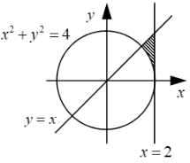   |
|      2      | 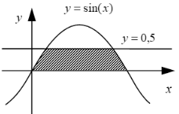   |
|      3      | 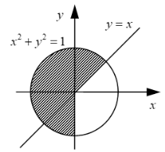   |
|      4      | 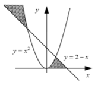   |
|      5      | 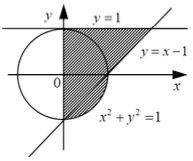   |
|      6      | 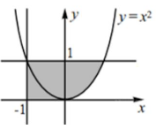   |
|      7      | 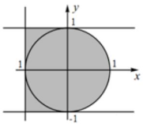   |
|      8      | 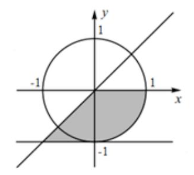   |
|      9      | 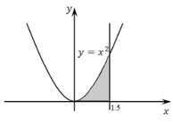   |
|     10      | 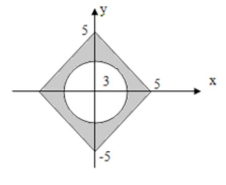 |
|     11      | 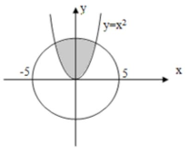 |
|     12      | 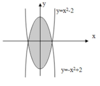 |
|     13      | 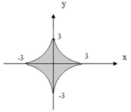 |
|     14      | 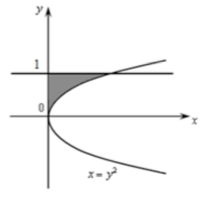 |
|     15      | 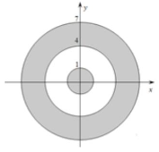 |

### Задание 3. Написать программу

| **Вариант** | **Задание**                                                                                                                                                                                                                                                                                                                                           |
|:-----------:|:------------------------------------------------------------------------------------------------------------------------------------------------------------------------------------------------------------------------------------------------------------------------------------------------------------------------------------------------------|
|      1      | Заданы три числа: а, b, с. Определить, могут ли они быть сторонами треугольника, и если да, то определить его тип: равносторонний, равнобедренный, разносторонний. Замечание. Нельзя исключать экстремальных случаев, когда одна (или несколько) сторон равны нулю либо когда одно из неравенств переходит в равенство (треугольник нулевой площади). |
|      2      | Треугольник задан длинами своих сторон: а, b, с. Определить, является ли он тупоугольным, прямоугольным или остроугольным. Замечание. Достаточно, используя теорему косинусов, найти знаки косинусов внутренних углов треугольника, не вычисляя самих углов (они могут быть нулевыми или развернутыми).                                               |
|      3      | Четырехугольник АВCD задан координатами своих вершин на плоскости. Проверить, является ли он выпуклым. Замечание. Есть несколько способов проверки выпуклости: анализ линейных неравенств, задаваемых сторонами; разбиение четырехугольника на треугольники со сравнением сумм их площадей и другие.                                                  |
|      4      | Пройдет ли кирпич со сторонами а, b и с сквозь прямоугольное отверстие со сторонами r и s? Стороны отверстия должны быть параллельны граням кирпича.                                                                                                                                                                                                  |
|      5      | Может ли шар радиуса r пройти через ромбообразное отверстие с диагоналями р и d?                                                                                                                                                                                                                                                                      |
|      6      | Два отрезка на плоскости заданы координатами своих концов. Определить, имеют ли эти отрезки общие точки. Замечание. Необходимо рассмотреть различные случаи взаимной ориентации отрезков: на одной прямой, на параллельных или пересекающихся прямых. Тестирование должно предусмотреть все такие ситуации.                                           |
|      7      | Как известно, число делится на 3 тогда и только тогда, когда сумма его цифр делится на 3. Проверить этот признак на примере заданного трехзначного числа. Теоретическое утверждение о признаке делимости предлагается проверить на примере любого вводимого числа. Признак считается доказанным, но не будет лишним поиск для него контрпримеров.     |
|      8      | На шахматной доске стоят черный король и три белые ладьи (ладья бьет по горизонтали и вертикали). Проверить, не находится ли король под боем, а если есть угроза, то от кого именно.                                                                                                                                                                  |
|      9      | На шахматной доске стоят черный король и белые ладья и слон (ладья бьет по горизонтали и вертикали, слон – по диагоналям). Проверить, есть ли угроза королю и если есть, то от кого именно. Учесть возможность защиты (например, ладья не бьет через слона).                                                                                          |
|     10      | На шахматной доске стоят три ферзя (ферзь бьет по вертикали, горизонтали и диагоналям). Найти те пары из них, которые угрожают друг другу.                                                                                                                                                                                                            |
|     11      | В шашечном эндшпиле остались белая дамка и две черных пешки, позиции которых известны. Ход белых. Сможет ли дамка срубить одну или сразу обе пешки?                                                                                                                                                                                                   |
|     12      | Вклад. Банк предлагает 3 вида срочных вкладов: на 3 месяца под р1%, на 6 месяцев под р2% и на год под p3%. Какой из вкладов наиболее выгоден для вкладчика?                                                                                                                                                                                           |
|     13      | Найти расстояние между двумя произвольно заданными на плоскости отрезками.                                                                                                                                                                                                                                                                            |
|     14      | Из круга какого наименьшего радиуса можно вырезать треугольник со сторонами а, b, с?                                                                                                                                                                                                                                                                  |
|     15      | Написать программу решения квадратного уравнения вида ax^2+bx+c=0, где a≠0, где x – переменная, a, b, c – числовые коэффициенты.                                                                                                                                                                                                                      |

## Контрольные вопросы

___

1. Для чего используются условные операторы в программировании?
2. Как выглядит полная форма оператора ветвления в языке Python?
3. Для чего используется часть else в операторе ветвления?
4. Какие основные операторы вы использовали при решении задач из
   лабораторной работы?

## Содержание отчета

___

1. Титульный лист
2. Цель и задачи работы
3. Задание
4. Описание выполнения алгоритма
5. Исходный код программы
6. Результаты работы программы
7. Ответы на контрольные вопросы.
8. Общий вывод о проделанной работе.