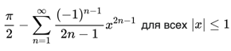
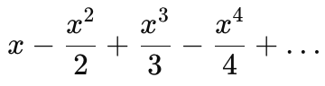
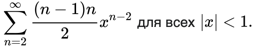

# Лаораторная работа № 3 - Циклы в языке Python

**Время выполнения - 6 часа**

## Содержание

___

1. [Общие теоретические сведения](#общие-теоретические-сведения)
2. [Практические задания](#практические-задания)
3. [Задания для самостоятельного выполнения (по вариантам)](#задания-для-самостоятельного-выполнения-по-вариантам)
    * [Задание 1](#задание-1-написать-программу)
    * [Задание 2](#задание-2-написать-программу)
    * [Задание 3](#задание-3-написать-программу)
4. [Контрольные вопросы](#контрольные-вопросы)
5. [Содержание отчета](#содержание-отчета)

## Цель работы:

___

Научиться разрабатывать программы, реализующие циклические алгоритмы.

## Задачи работы:

___

1. Изучить формы циклических алгоритмов;
2. Научиться использовать операторы цикла в среде программирования на языке Python;
3. Научиться разрабатывать программы, реализующие циклические алгоритмы.

## Общие теоретические сведения

___

Цикл в языке программирования представляет собой конструкцию, многократно
выполняющую одну и ту же группу операторов. Число повторений (итераций) цикла
может быть либо задано заранее, либо зависеть от истинности некоторого условия.

В реальной жизни постоянно применяются циклы, поэтому циклический алгоритм
часто используются при решении задач по программированию.

В языке программирования Python может быть реализовано два вида цикла:

1) с предусловием – цикл `while`;
2) с параметром – цикл `for`.

Цикл `while` является часто используемым и универсальным циклом в Python.
Полный формат данного цикла:

```python
while < условие >:
    < оператор1 >
else:
    < оператор2 >
```

Выполнение цикла `while` начинается с проверки условия. Если оно истинно (не
равно `false`), выполняется оператор цикла. Если при первой же проверке выражение в
условии равно `false`, цикл не выполнится ни разу. Если условие в цикле `while` никогда не
станет ложным, то не будет причин остановки цикла и программа «зациклится». Чтобы
этого не произошло, необходимо организовать момент выхода из цикла, т. е. ложность
выражения в условии. Так, например, изменяя значение какой-нибудь переменной в теле
цикла, можно довести логическое выражение до ложности. Обратите внимание, что
операторы тела цикла должны быть записаны с отступом.

Рассмотрим пример:

```python
i = 5
while i < 15:
    print(i)
    i += 2
```

В данном примере организован перебор значений переменной `i` с шагом 2. Условие
работы цикла: `i<15`. В теле цикла происходит изменение (увеличение) переменной `i`,
поэтому цикл не будет бесконечным.

Второй цикл, используемый в языке Python, – цикл с параметром. Синтаксис
данного цикла:

```python
for < переменная > in < объект >:
    < оператор1 >
else:
    < оператор2 >
```

Этот цикл перебирает заданную последовательность значений любого
итерируемого объекта (например, строки или списка) и для каждого значения выполняет
тело цикла.

Цикл выполняется заданное число раз. Для обращения к текущему элементу
последовательности обычно используется переменная цикла, её иногда называют
управляющей переменной.

Часто для организации работы цикла с параметром `for` используется функция `range`.
Функция `range()` возвращает последовательность чисел, регулируемую переданными в
неё аргументами. Возможны следующие варианты обращения к данной функции:

1) `range(finish)`
2) `range(start, finish)`
3) `range(start, finish, step)`

Здесь start – это первый элемент последовательности (включительно), finish –
последний (не включительно), а step – разность между следующим и предыдущим
членами последовательности.

Например, `range(5)` возвращает последовательность 0, 1, 2, 3, 4. Вызов `range(2,8)`
возвращает последовательность 2, 3, 4, 5, 6, 7.

Рассмотрим примеры организации работы цикла с параметром:

```python
for a in range(10):
    print(a)
```

В данном примере цикл выводит на экран последовательность чисел от 0 до 9
включительно.

Также, говоря про работу циклов в языке Python, необходимо упомянуть про
операторы `continue`, `break`, `else`.

Оператор `continue` используется для перехода на следующую итерацию цикла,
пропуская следующие после continue операторы тела цикла.

Оператор `break` используется для организации немедленного выхода из цикла. Это
означает, что происходит досрочное завершение работы цикла.

Оператор `else` используется для проверки, был ли произведён выход из цикла
посредством оператора break или же цикл завершился иным образом.

Например:

```python
for i in range(10):
    if i == 20:
        break
    print(i * 2, end=" ")
else:
    print("значение не найдено")
```

В данном примере после вывода на экран последовательности от 0 до 18 на экран
также выводится строка «значение не найдено», так как оператор break не сработал.

Также в языке Python возможно использование вложенных циклов, когда есть один
внешний цикл и один или несколько вложенных. Стоит отметить, что использование
вложенных циклов может замедлить работу программы.

## Практические задания

___ 

1. На тренировке спортсмен ежедневно пробегает некоторую дистанцию, с
   каждым днём увеличивая её на 10%. Составить программу, определяющую по
   расстоянию, преодолённому спортсменом в первый день тренировки, длину дистанции
   на k-й день;
2. Перевести введённое пользователем десятичное число в двоичное. Известно,
   что число меньше 256.
3. Разложить натуральное число на простые множители.
4. Население города на 2021 г. насчитывало 620 тыс. человек. Считая темп
   прироста населения за год равным 3,7%, определить, в каком году оно превысит 1,5 млн
   человек.
5. Найти сумму нечётных делителей введённого с клавиатуры натурального
   числа.
6. Найти все натуральные числа из отрезка [1; 200], у которых количество
   делителей равно n (где n вводится с клавиатуры).
7. Найти все четырёхзначные числа, у которых сумма крайних цифр равна
   сумме средних (например, 3221).
8. Найти все двухзначные числа, которые при умножении на 2 заканчиваются
   на 8, а при умножении на 3 – на 4.

## Задания для самостоятельного выполнения (по вариантам)

___

### Задание 1. Написать программу

| **Вариант** | **Задание**                                                                                                                                                           |
|:-----------:|:----------------------------------------------------------------------------------------------------------------------------------------------------------------------|
|      1      | Напишите программу, которая вычисляет сумму квадратов всех чисел от 1 до 100 с использованием цикла `while`.                                                          |
|      2      | Напишите программу, которая запрашивает у пользователя число и выводит на экран его простые множители.                                                                |
|      3      | Напишите программу, которая находит сумму всех простых чисел в заданном диапазоне.                                                                                    |
|      4      | Напишите программу, которая проверяет, является ли введенное пользователем число совершенным (сумма всех его делителей, кроме самого числа, равна этому числу).       |
|      5      | Напишите программу, которая выводит на экран все числа Армстронга в заданном диапазоне.                                                                               |
|      6      | Напишите программу, которая вычисляет сумму цифр факториала введенного пользователем числа с использованием цикла `while`.                                            |
|      7      | Напишите программу, которая находит наибольшее число из списка, в котором элементы задаются пользователем, с использованием цикла `for`. Запрещено использовать `max` |
|      8      | Напишите программу, которая находит среднее арифметическое всех чисел в списке.                                                                                       |
|      9      | Напишите программу, которая проверяет, является ли введенное пользователем число числом Фибоначчи с использованием цикла `while`.                                     |
|     10      | Напишите программу, которая выводит на экран все палиндромы в заданном диапазоне.                                                                                     |
|     11      | Напишите программу, которая находит сумму квадратов четных чисел от 1 до 1000 с использованием цикла `while`.                                                         |
|     12      | Напишите программу, которая находит наименьший общий делитель двух чисел с использованием цикла `for`.                                                                |
|     13      | Напишите программу, которая определяет, является ли введенное пользователем число числом Армстронга с использованием цикла `while`.                                   |
|     14      | Напишите программу, которая находит сумму цифр числа введенного пользователем в двоичной системе счисления с использованием цикла `while`.                            |
|     15      | Напишите программу, которая выводит на экран числа Фибоначчи до определенного предела, который вводится пользователем, с использованием цикла `for`                   |

### Задание 2. Написать программу

| **Вариант** | **Задание**                                                                                                                                                                            |
|:-----------:|:---------------------------------------------------------------------------------------------------------------------------------------------------------------------------------------|
|      1      | Напишите программу для вычисления значения выражения `sin(x)` с использованием ряда Тейлора.<br/>                                                            |
|      2      | Напишите программу для вычисления значения выражения `arccotan(x)` с использованием ряда Тейлора. <br/>                                                      |
|      3      | Напишите программу для вычисления значения выражения `cos(x)` с использованием ряда Тейлора.<br/>                                                            |
|      4      | Напишите программу для вычисления значения выражения `e^x` с использованием ряда Тейлора. <br/>                                                              |
|      5      | Напишите программу для вычисления значения выражения `exp(x)` с использованием ряда Фурье.<br/><br/>                         |
|      6      | Напишите программу для вычисления значения выражения `ln(1+x)` с использованием ряда Тейлора. <br/>                                                          |
|      7      | Напишите программу для вычисления значения выражения                                                                                                         |
|      8      | Напишите программу для вычисления значения выражения `arctan(x)` с использованием ряда Тейлора. <br/>                                                        |
|      9      | Напишите программу для вычисления значения выражения `(1+x)^n` с использованием биномиальной формулы. <br/>  <br/>         |
|     10      | Напишите программу для вычисления значения выражения `cosex(x)` с использованием ряда Тейлора. <br/>                                                         |
|     11      | Напишите программу для вычисления значения выражения `log(x)` с использованием ряда Маклорена для `ln(1+x)`. <br/>  <br/>  |
|     12      | Напишите программу для вычисления значения выражения `ctan(x)` с использованием ряда Тейлора. <br/>                                                          |
|     13      | Напишите программу для вычисления значения выражения `sex(x)` с использованием ряда Тейлора. <br/>                                                           |
|     14      | Напишите программу для вычисления значения выражения `tan(x)` с использованием ряда Рейлора. <br/>                                                           |
|     15      | Напишите программу для вычисления значения выражения `arccos(x)` с использованием ряда Тейлора. <br/>                                                        |

### Задание 3. Написать программу

| **Вариант** | **Задание**                                                                                                                                                                                                                                                                |
|:-----------:|:---------------------------------------------------------------------------------------------------------------------------------------------------------------------------------------------------------------------------------------------------------------------------|
|      1      | Напишите программу, которая подсчитывает количество слов в предложении, используя цикл.                                                                                                                                                                                    |
|      2      | Напишите программу, которая проверяет, являются ли две строки анаграммами друг друга, используя цикл.                                                                                                                                                                      |
|      3      | Напишите программу, которая удаляет дубликаты из списка, используя цикл.                                                                                                                                                                                                   |
|      4      | Напишите программу, которая выводит на экран таблицу умножения от 1 до 10, используя цикл.                                                                                                                                                                                 |
|      5      | Напишите программу, которая запрашивает у пользователя строку и выводит количество гласных букв в этой строке, используя цикл.                                                                                                                                             |
|      6      | Напишите программу, которая находит все простые числа в заданном диапазоне, используя метод перебора делителей.                                                                                                                                                            |
|      7      | Напишите программу, которая находит сумму всех элементов матрицы, находящихся на главной диагонали.                                                                                                                                                                        |
|      8      | Напишите программу, которая находит среднее арифметическое всех элементов списка, находящихся на нечетных позициях.                                                                                                                                                        |
|      9      | Напишите программу, которая находит количество различных символов в строке.                                                                                                                                                                                                |
|     10      | Напишите программу, которая находит сумму всех чисел в диапазоне, удовлетворяющих  условию (кратных 3 и 5).                                                                                                                                                                |
|     11      | Напишите программу, которая считает количество чётных цифр введённого числа.                                                                                                                                                                                               |
|     12      | Дано вещественное число – цена 1 кг конфет. Вывести стоимость 1, 2, ..., 10 кг конфет.                                                                                                                                                                                     |
|     13      | Напишите программу, которая вводит с клавиатуры числа до тех пор, пока не будет введено число 0. В конце работы программы на экран выводится сумма и произведение введенных чисел (не считая 0)                                                                            |
|     14      | Предприниматель, начав дело, взял кредит размером k рублей под р процентов годовых и вложил его в свое дело. По прогнозам, его дело должно давать прибыль r рублей в год. Сможет ли он накопить сумму, достаточную для погашения кредита, и если да, то через сколько лет? |
|     15      | Дано вещественное число – цена 1 кг конфет. Вывести стоимость 1.2, 1.4, ..., 2 кг конфет.                                                                                                                                                                                  |

## Контрольные вопросы

___

1. Для чего используются циклы в языке программирования?
2. Чем отличаются циклы `for` и `while` в Python? Какой из них более удобен для работы с последовательностями?
3. Каков синтаксис оператора цикла `while`?
4. Каков синтаксис оператора цикла `for`?
5. Как можно прервать выполнение цикла в Python до его завершения?
6. В чем состоит разница между операторами `continue` и `break` в контексте работы с циклами? Какие примеры
   использования этих операторов вы можете привести?

## Содержание отчета

___

1. Титульный лист
2. Цель и задачи работы
3. Задание
4. Описание выполнения алгоритма
5. Исходный код программы
6. Результаты работы программы
7. Ответы на контрольные вопросы.
8. Общий вывод о проделанной работе.